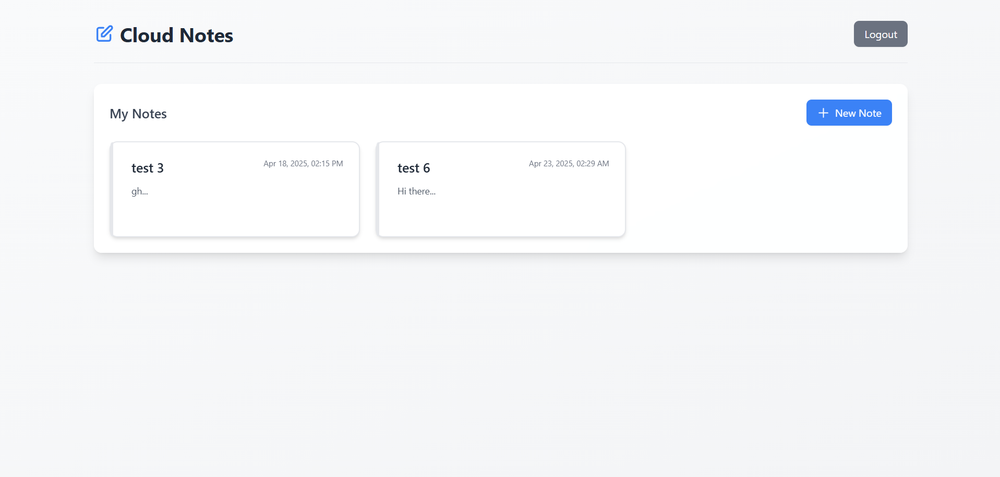
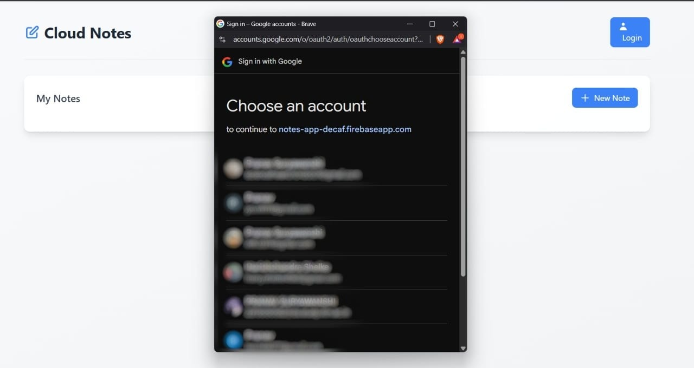
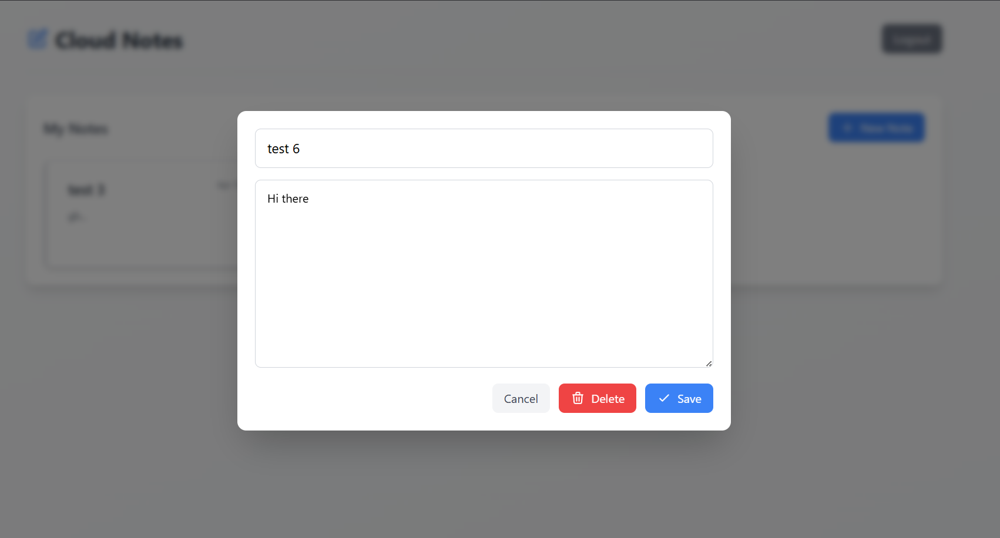

# ✨ Cloud Notes App ✨



📝 A sleek, modern notes-taking web application with real-time cloud storage powered by Firebase. Keep your thoughts synchronized across all your devices with this beautiful, minimalist note-taking experience.

## ✅ Features

- 📱 Responsive design - works on desktop, tablet, and mobile
- 🔄 Real-time synchronization across all devices
- 🔐 Secure Google Authentication
- ✏️ Create, edit, and delete notes
- 💾 Auto-save functionality
- 🌈 Clean, modern UI with smooth transitions
- 🌙 Light & airy design aesthetic

## 📸 Screenshots

### Home Screen


### Login Screen


### Note Editor


## 🚀 Getting Started

### Prerequisites

- A Firebase account (free tier works perfectly)
- Basic knowledge of HTML, CSS, and JavaScript
- A modern web browser

### 🔧 Installation

1. **Clone the repository**
   ```bash
   git clone https://github.com/yourusername/cloud-notes-app.git
   cd cloud-notes-app
   ```

2. **Create a Firebase project**
   - Go to [Firebase Console](https://console.firebase.google.com/)
   - Create a new project
   - Enable Google Authentication
   - Create a Realtime Database
   - Set up database rules for security

3. **Configure environment variables**
   - Copy `config.template.js` to `config.js`
   ```bash
   cp config.template.js config.js
   ```
   - Edit `config.js` and add your Firebase configuration values
   - OR create a `.env` file with your Firebase configuration:
   ```
   FIREBASE_API_KEY=your-api-key
   FIREBASE_AUTH_DOMAIN=your-auth-domain
   FIREBASE_DATABASE_URL=your-database-url
   FIREBASE_PROJECT_ID=your-project-id
   FIREBASE_STORAGE_BUCKET=your-storage-bucket
   FIREBASE_MESSAGING_SENDER_ID=your-messaging-sender-id
   FIREBASE_APP_ID=your-app-id
   FIREBASE_MEASUREMENT_ID=your-measurement-id
   ```
   - Then generate the config file:
   ```bash
   node generate-config.js
   ```

4. **Set up Firebase Security Rules**
   - Copy the contents of `firebase-security-rules.json` to your Firebase console
   ```json
   {
     "rules": {
       ".read": false,
       ".write": false,
       "notes": {
         "$uid": {
           ".read": "$uid === auth.uid",
           ".write": "$uid === auth.uid",
           "$noteId": {
             ".validate": "newData.hasChildren(['title', 'content', 'updatedAt'])",
             "title": {
               ".validate": "newData.isString()"
             },
             "content": {
               ".validate": "newData.isString()"
             },
             "updatedAt": {
               ".validate": "newData.isNumber()"
             },
             "$other": {
               ".validate": false
             }
           }
         }
       }
     }
   }
   ```

5. **Run the application**
   - You can use any local server to run the application
   - Using Node.js's `http-server`:
     ```bash
     npx http-server
     ```
   - Or using Python's built-in server:
     ```bash
     python -m http.server 8000
     ```

6. **Open your browser**
   - Navigate to `http://localhost:8000` or the appropriate port

## 🔒 Security Best Practices

### 🛡️ API Keys Protection

This project uses environment variables to store sensitive API keys. Here's how to keep them secure:

1. **Never commit `.env` or `config.js` to version control**
   - Both contain sensitive API keys and are listed in `.gitignore`
   - Use `config.template.js` as a reference

2. **Firebase Security Rules**
   - The included `firebase-security-rules.json` ensures only authenticated users can access their own data
   - Always deploy proper security rules to your Firebase project

### 🔐 Production Security

For production deployments, consider these enhanced security measures:

1. **🔑 Firebase App Check**
   - Adds a security layer to verify legitimate app instances
   - [Learn more about App Check](https://firebase.google.com/docs/app-check)

2. **⛓️ API Key Restrictions**
   - Restrict API keys by domain, IP, or API in the Firebase console
   - [API Credentials Management](https://console.cloud.google.com/apis/credentials)

3. **🔨 Build Process**
   - Use tools like Webpack to inject environment variables at build time
   - This avoids storing API keys in client-side code

4. **🖥️ Backend Authentication Service**
   - For maximum security, create a backend that handles authentication
   - Provide temporary tokens to the frontend instead of API keys

> ⚠️ **Important**: Client-side API keys are never 100% secure. Firebase Security Rules are your primary defense against unauthorized data access.

## 📱 Usage

1. Click the "Login" button to sign in with your Google account
2. Once logged in, you'll see your existing notes (if any)
3. Click "New Note" to create a new note
4. Enter a title and content for your note
5. Click "Save" to store your note in the cloud
6. Click on any existing note to edit it
7. Use the "Delete" button to remove unwanted notes

## 🧰 Technologies Used

- 🧩 HTML5 & CSS3
- 📊 JavaScript
- 🔥 Firebase Realtime Database
- 🔐 Firebase Authentication
- 🎨 Tailwind CSS
- 🔄 Firebase Realtime Sync

## 📝 License

This project is licensed under the MIT License - see the LICENSE file for details.

## 👏 Acknowledgments

- 🙏 Firebase team for the excellent documentation
- 💡 Tailwind CSS for the beautiful styling utilities
- 🌐 Open source community for inspiration

## 📧 Contact

For any questions or suggestions, please reach out to:
- Your Name - youremail@example.com
- Project Link: [https://github.com/yourusername/cloud-notes-app](https://github.com/yourusername/cloud-notes-app)

---

Made with ❤️ and ☕ 